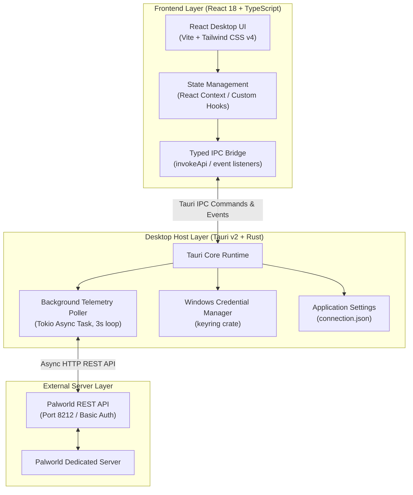
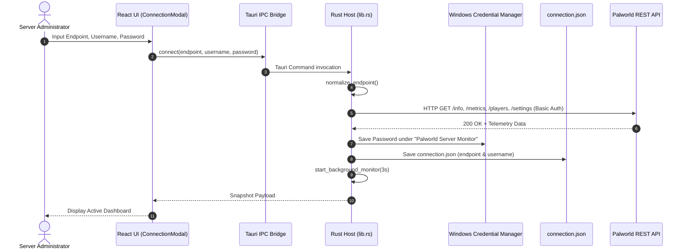

# Architecture Overview: Palworld Server Monitor

**Palworld Server Monitor** is a low-latency, desktop server management tool built on top of **Tauri v2**, **Rust**, **React 18**, and **TypeScript**. It allows server administrators to monitor server health, observe connected players and game entities, broadcast announcements, manage server state, and moderate players securely over Palworld's REST API.

---

## 1. System Architecture Diagram



---

## 2. Component Layering & Responsibilities

### Frontend Layer (`src/`)
- **UI Components (`src/components/`)**:
  - `OverviewTab.tsx`: Primary dashboard showing Server FPS, Frame Time, Player Count, Uptime, Base Camps, and Days, plus historical telemetry sparklines.
  - `PlayersTab.tsx`: Real-time active player table with search, sorting, detailed stats (Level, Ping, Coordinates, Building Count), and moderation triggers.
  - `GameDataTab.tsx`: In-depth breakdown of server actors (Pals, Bosses, Rares, Guilds, HP, AI Actions).
  - `DiagnosticsTab.tsx`: System health check overview, connection latency status, raw JSON snapshot inspection, and built-in unit test execution.
  - `SettingsTab.tsx`: Server connection details, refresh interval adjustments, and session disconnection tools.
  - Modals: `ConnectionModal`, `ServerControlsModal`, `BroadcastModal`, `BanListModal`.
- **API & IPC Wrapper (`src/api.ts` & `src/types/ipc.ts`)**:
  - Strongly typed wrappers around Tauri's `invoke` IPC call.
  - Event listeners (`onTelemetryUpdate`, `onTelemetryError`) that bridge Rust background events directly into React state.
  - Error parsing utility (`parseError`) converting raw Rust error strings into structured user-friendly `ConnectionError` objects with troubleshooting steps.

### Desktop Host Layer (`src-tauri/`)
- **Tauri Core & Command Handler (`src-tauri/src/lib.rs`)**:
  - Implements 14 Tauri command handlers exposed to the frontend via IPC.
  - Manages thread-safe application state (`MonitorState`) holding the background poller join handle.
  - Handles endpoint normalization (e.g. converting bare IP/host inputs into canonical `/v1/api` REST URLs).
  - Manages secure credential storage using Windows Credential Manager (`keyring` crate).
  - Spawns background Tokio monitoring loop that polls telemetry endpoints concurrently every 3 seconds using `tokio::join!` and `tokio::try_join!`.

---

## 3. Data & Communication Flow

### Connection & Authentication Flow



### Telemetry Background Polling Loop

1. **Initialization**: Upon successful connection or app startup (if saved connection exists), `start_background_monitor` spawns an async Tokio background task.
2. **Execution Interval**: Defaults to every 3 seconds (configurable).
3. **Concurrent HTTP Requests**: Uses `tokio::join!` to fetch server info (`/info`), metrics (`/metrics`), active players (`/players`), and settings (`/settings`) concurrently, while simultaneously fetching game entity data (`/game-data`).
4. **Event Emission**:
   - On success: Emits Tauri event `telemetry-update` containing the latest `Snapshot`.
   - On failure: Emits Tauri event `telemetry-error` containing formatted error code string.

---

## 4. Security & Storage Model

```
+-------------------------------------------------------------------+
|                        SECURITY ARCHITECTURE                      |
+-------------------------------------------------------------------+
|                                                                   |
|   NON-SENSITIVE CONFIG (Plaintext Disk)                            |
|   Location: %APPDATA%/com.palworld.servermonitor/connection.json  |
|   Contents: { "endpoint": "http://127.0.0.1:8212/v1/api",        |
|               "username": "admin" }                               |
|                                                                   |
|   SENSITIVE CREDENTIALS (Secure OS Storage)                       |
|   Storage: Windows Credential Manager                             |
|   Target Name: Palworld Server Monitor                            |
|   Account: palworld-rest-api                                      |
|   Contents: Protected Admin Password                              |
|                                                                   |
+-------------------------------------------------------------------+
```

- **Credential Protection**: Admin passwords are **never** stored in browser `localStorage`, session storage, or plaintext configuration files. They are routed directly to the native OS secure vault (Windows Credential Manager) via the Rust `keyring` crate.
- **REST API Isolation**: Communication with the server occurs strictly via Basic Authentication headers over HTTP/HTTPS.

---

## 5. Error Handling Architecture

Rust errors are returned as formatted string responses adhering to `[code] message` syntax, managed by `AppError`.

| Error Code | Trigger Condition | Frontend Error Title | Troubleshooting Guidance Provided |
| :--- | :--- | :--- | :--- |
| `auth` | HTTP 401 Unauthorized | Authentication Failed | Check `AdminPassword` in `PalWorldSettings.ini` and verify default username `admin`. |
| `timeout` | Connection exceeds 10s | Connection Timeout | Check server process, verify `RESTAPIEnabled=True`, check firewall port 8212. |
| `malformed_response` | Invalid JSON from server | Malformed Response | Ensure connection is pointing to REST API port (8212), not game UDP port (8211). |
| `unavailable` | HTTP 5xx or network unreachable | Server Unavailable | Verify host IP/URL, LAN subnet routing, and HTTP scheme (`http://`). |
| `bad_request` | HTTP 400 or missing fields | Invalid Request | Check request parameters and URL syntax. |
